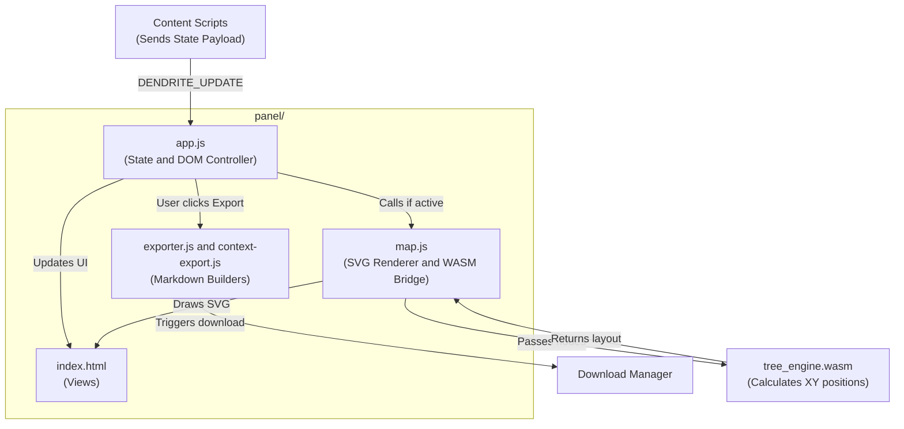

# 🖥️ Architecture: Panel UI & State Management

The Panel represents the frontend interface of Dendrite. It lives inside the Chrome Side Panel API (`chrome.sidePanel`) and acts as an independent application reacting to state changes from the active tab.

## 📊 Panel Component Hierarchy



## 🧠 State Management (`panel/app.js`)
Dendrite does not use frameworks like React or Vue to ensure maximum performance and minimal memory overhead. Instead, it relies on a central `state` object inside `app.js`.

When `main.js` (content script) finishes parsing a chat, it broadcasts the payload. `app.js` ingests this payload, overwrites its internal state, and calls `render()`.

```javascript
const state = {
  questions: [],
  responses: [],
  codeBlocks: [],
  links: [],
  artifacts: [],
  activeFilter: 'questions', // controls which tab is visible
  searchQuery: '',
  // ...
};
```

## 🔄 DOM Manipulation
The `render()` function is a pure vanilla JS builder. It dynamically creates HTML elements (`document.createElement`) and leverages `DocumentFragment` to batch DOM insertions, preventing layout thrashing and guaranteeing smooth UI updates even when indexing chats with thousands of nodes.

## 🗂️ Exporter Modules (`exporter.js` & `context-export.js`)
When a user clicks "Export Dev-Doc" or "Export Context README", `app.js` hands the current `state` object over to these modules.
1. They iterate over the `state.questions` and `state.responses`.
2. They intelligently interleave the questions with their corresponding response artifacts and code snippets.
3. They generate a pure Markdown string.
4. They create a temporary `Blob` and trigger a silent browser download, bypassing the need for backend servers.

## 🗺️ The Map Interface (`map.js`)
When the user clicks the "Map" filter, `app.js` delegates control to `map.js`.
- It takes the 1D array of `questions` (which contain `parentId` relationships).
- It communicates with the WASM engine (detailed in the next doc) to compute the graph structure.
- It then uses the `d3`-like approach (but in pure vanilla JS) to inject `<circle>` and `<path>` SVG elements into the `.map-viewport`.
- It handles complex interactions like zooming, panning, and highlighting ancestor chains when a node is clicked.
