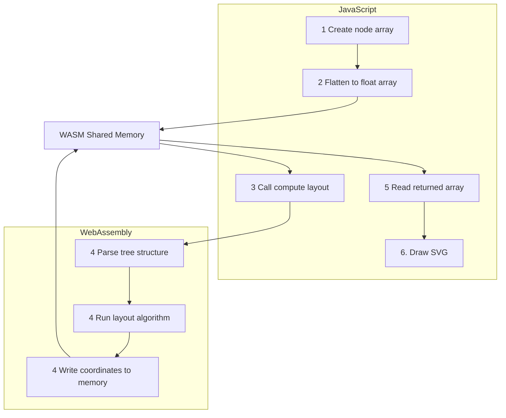

#  Architecture: WASM Tree Engine

The most computationally intensive feature of Dendrite is the Logic Map. Parsing hundreds of nested questions and calculating a visually pleasing, non-overlapping dendrogram layout in pure JavaScript would cause significant UI blocking. To solve this, Dendrite uses a **C++ to WebAssembly (WASM)** pipeline.

##  WASM Data Flow



##  C++ Layout Algorithm (`wasm/tree_engine.cpp`)
The core file is a compact (~160 LOC) C++ engine. It implements a modified **Reingold-Tilford layout algorithm**.
1. **Tree Construction:** It reads the flat array of `parentId` references from the JS heap and constructs a bidirectional tree graph in memory.
2. **First Pass (Bottom-Up):** It calculates the minimum required width for each subtree, ensuring that sibling nodes and their children never overlap.
3. **Second Pass (Top-Down):** It distributes the coordinates, assigning precise `(X, Y)` floating-point values to each node based on the maximum depth and available viewport height.
4. **Return:** It overwrites the initial memory block with the finalized coordinates, yielding control back to JavaScript in less than a millisecond.

##  The Emscripten Build Pipeline (`wasm/build.sh`)
To convert the C++ into something the browser can run, we use the Emscripten SDK (`emsdk`).

```bash
# Example compilation flags used in build.sh
emcc tree_engine.cpp \
  -O3 \
  -s WASM=1 \
  -s EXPORTED_FUNCTIONS="['_compute_layout', '_malloc', '_free']" \
  -s EXPORTED_RUNTIME_METHODS="['ccall', 'cwrap']" \
  -o ../panel/tree_engine.js
```

- `-O3`: Maximum optimization. The resulting WASM binary is heavily minified (usually <20KB).
- `EXPORTED_FUNCTIONS`: We explicitly expose `_malloc` and `_free` so JavaScript can manually allocate space on the WASM heap to pass the initial data in.
- **Artifacts:** The compilation produces `tree_engine.wasm` (the binary) and `tree_engine.js` (the auto-generated glue code that instantiates the binary and handles the memory bridge).

Because these artifacts are pre-compiled and committed to the `panel/` directory, end-users do **not** need a C++ compiler to install or run the extension. The engine executes natively in the browser sandbox.
